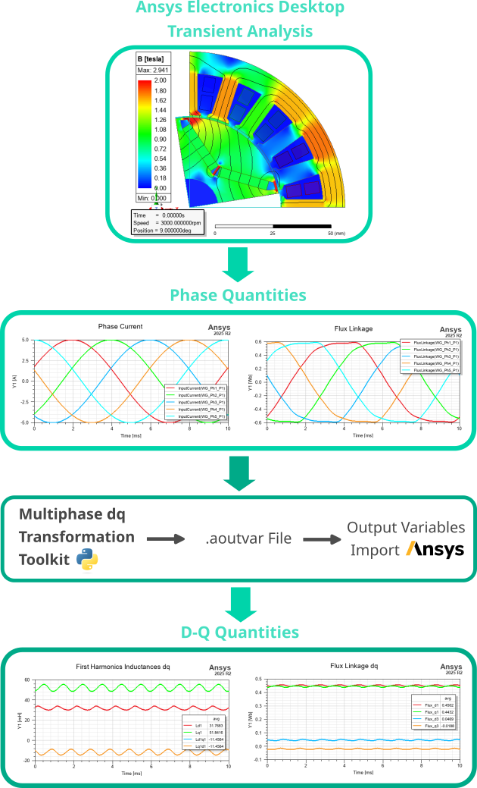

# Multiphase dq Transformation Toolkit for Ansys Electronics Desktop
Python toolkit for generating **d-q harmonic transformations and inductance projections** for multiphase electric machines in Ansys Electronics Desktop (AEDT).

The toolkit automatically derives transformation matrices, harmonic dq components, and projected inductances from a general multiphase system.
The resulting expressions can be exported directly as **Output Variables** usable in **Ansys Electronics Desktop models**.

## Overview
Multiphase electric machines require systematic transformation of phase quantities into *d*-*q* harmonic components.
This project provides a structured method for deriving:

- dq harmonic transformations for arbitrary phase numbers
- projections of phase inductances into harmonic dq components
- symbolic expressions suitable for Ansys variable definitions
- export of .aoutvar file, prepared for the Output Variables import

The toolkit is primarily designed for workflows involving **Ansys Electronics Desktop simulations** of **electrical machines**.

## Features
The *d*-*q* variables are generated automatically when the Electronics Desktop transient model is generated from the RMXprt analytical model or when it is exported from the Ansys Motor-CAD model. This Toolkit uses the same approach with the same outputs, extended for the calculation of: 

- cross-coupling inductances
- excitation flux linkage from incremental inductance (necessary for optimal control of saturated machines)
- phase voltages of current-fed FEM models
- terminal voltages without zero-sequence components of current-fed FEM models

For more information, see `docs/Theoretical Background.pdf`.

## Usage

The Toolkit itselv is locat in `src/` directory.
The Toolkit is prepared as a one-click solution, where everything is operated via a single file `user_input.py`. 

1. Define machine parameters in `user_input.py`
2. Run this script
3. The toolkit generates expressions for harmonic dq variables and exports as a .aoutvar file.
4. (optional). You can delete the existing Output Variables by running `AEDT_OutputVariables_delete.py` in Ansys EDT.
5. Exported .aoutvar file can be imported into Ansys Electronics Desktop:
   Results → Output Variables → Import

## Documentation

Examples of generated .aoutvar files are located in `examples/`.

Additional documentation is available in the `docs` directory:

- **Theoretical background**  
  `docs/Theoretical Background.pdf`

- **Implementation details for AEDT**  
  `docs/Practical Ansys EDT Implementation.md`

- **Output variable naming conventions**  
  `docs/output_variables_description_naming.md`