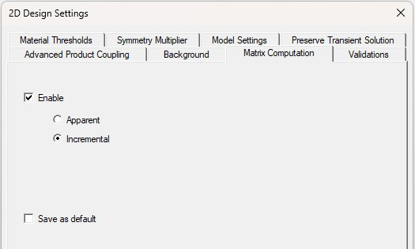
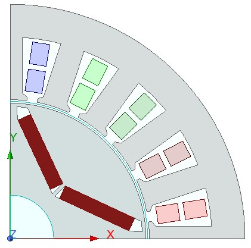
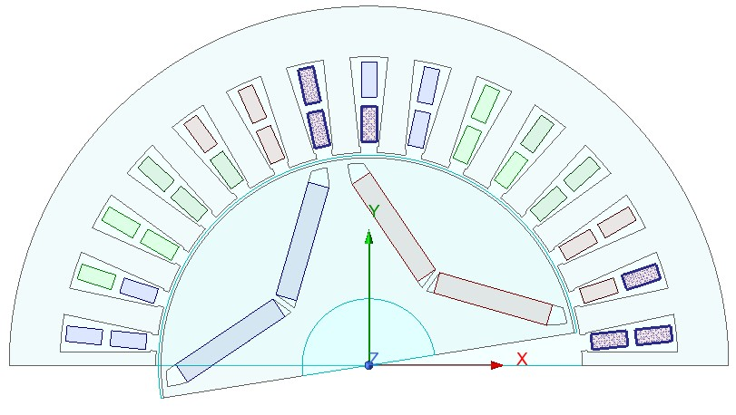
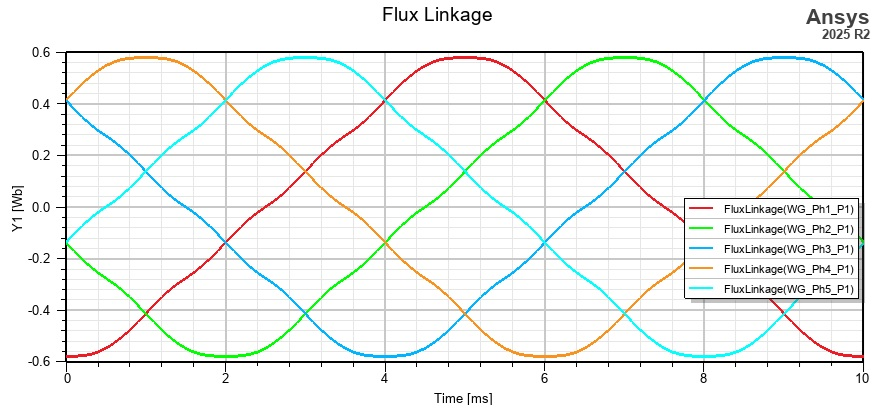
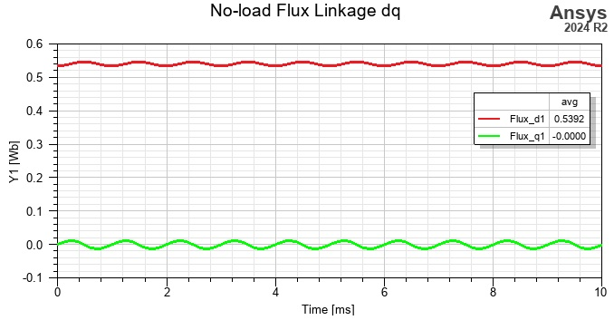

# Practical Ansys EDT Implementation

This document demonstrates the practical implementation of the Output Variables (.aoutvar) file in Ansys Electronics Desktop (EDT).
To ensure proper functioning of the generated .aoutvar file, the Ansys Electronics Desktop transient model of the rotating machine must be properly prepared.

## Inductances Calculation

The EDT design enables the inclusion or exclusion of inductance calculations. Defaultly, the inductances are not calculated when the model is exported from Motor-CAD. You can enable the calcualtion of inductances by:
Maxwell 2D/3D -> Design Settings -> Matrix Computation:

The Apparent and Incremental inductances can be calculated; they are equivalent to the static and dynamic definition of the inductance:

$L_{app} = \frac{\Psi}{i}$

$L_{inc} = \frac{d\Psi}{di}$

## Rotor and Stator Model Position
The rotor position is derived from models automatically generated by RMXprt of Ansys Motor-CAD. Before the calculation, the rotor is rotated so that the *x*-axis of the global coordinate system is placed between the south and north magnet so that the north magnet is placed in the first quadrant. If the symmetry of the geometry is applied, the rotor-geometry edge is usually aligned with the *x*-axis.

Similarly, the stator winding is placed so that the first phase belt of the first phase starts from the *x*-axis, and it is located in the first quadrant. 

If these conditions are not met, the *d*-*q* calculations can still provide proper results, but the initial conditions are necessary to be modified.

## Initial Position of Rotating Parts

Before the simulation, the mechanical Initial Position is defined (double-click the name of the Motion Setup -> Data). It ensures the rotor's position at zero time, and from this position, the rotor rotates at the defined speed in the transient analysis. If the model is generated from RMXprt of Motor-CAD, it is automatically adjusted. If the model geometry is built by the above-defined conditions, the Initial Position can be calculated directly by this Toolbox: with additional information about the number of slots, winding layers, and coil pitch. The "MechOffsetDeg" variable in the .aoutvar  file is then generated.

At the zero time position, the north permanent magnets must be rotated so that the axis of the magnetic flux is aligned with the axis of the first phase. 

It maximizes the PM flux linkage at this position. Therefore, the no-load analysis serves as a validation sequence. In the no-load condition, the flux linkage waveform starts at the negative amplitude and creates approximately a $-\cos{}$ function.

## Delete Output Variables

If the design includes Output Variables with the same names as the imported values, the import is skipped. Therefore, it is suitable to delete all the existing Output Variables. For this purpose, the `AEDT_OutputVariables_delete.py` script can be used. The script is run by Tools -> Run Script.

## Import .aoutvar file

Open Maxwell 2D/3D -> Results -> Output Variables. By the Import button, the .aoutvar file is found and opened. If "Validate output variables for selected context" is selected, valid expressions are blue.
If the design includes Output Variables with the same names as the imported values, the import is skipped. Therefore, it is suitable to delete all the existing Output Variables. For this purpose, the `AEDT_OutputVariables_delete.py` script can be used. The script is run by Tools -> Run Script.

## D-Q values validation
The *d*-*q* values must be constant values with small oscillations due to the asymmetry of the magnetic circuit. If it is a sinusoidal function, there is a wrong rotation sign or a wrong number of polepairs.

In the no-load state, the first harmonic flux linkage has a positive *d* value and a zero *q* value. 

Under the motor operation (positive torque calculated from the *d*-*q* components, Torque_dq), the *q*-axis flux linkage must be positive.

